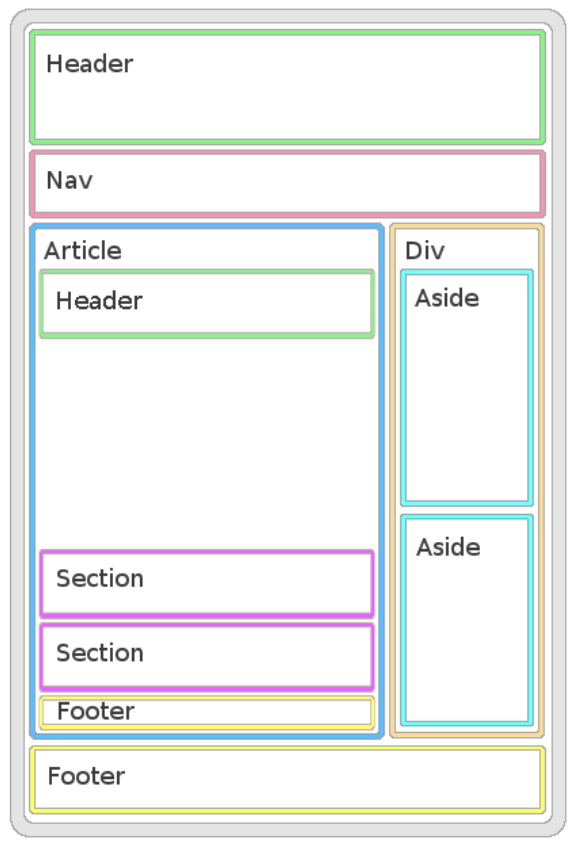

# ESTRUCTURA BÁSICA DE HTML

Edita el fichero "index.html" a tu derecha para que tenga una estructura de HTML que represente el esquema de la imagen siguiente:

(Los textos, bordes y colores de la imágen son una guía para mostrar los elementos y su anidamiento. El resultado no debe verse así)

El HTML resultante debe ser validado por el validador de HTML de la W3 y no dar ningún error. No te preocupes si salen warnings por no poner títulos a las sections y el article, lo importante es que no salga ningún error.
