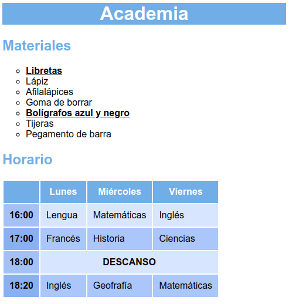

# PRIMERA MAQUETA

Edita el archivo "style.css" para dar los estilos necesarios para obtener un resultado como el de la imagen de abajo sin modificar el HTML (ni siquiera para añadir clases o IDs):

Se valorará, por orden de importancia:

    1. Los selectores utilizados

        a. Ten siempre en cuenta qué estas seleccionando (no es lo mismo algo importante que un primer hijo, aunque coincidan). Sólo si lo haces correctamente, el proyecto será escalable (se pueden añadir cosas o modificar el HTML y sigue viendose correctamente sin tener que cambiar el CSS).

    2. Las propiedades

        a. Toda la página tiene una tipografía sin serifa.

        b. La cabecera tiene color de fondo, y texto blanco y centrado.

        c. Lista:

            I. Las viñetas de la lista no son las que vienen por defecto.

            II. Los objetos importantes de la lista están subrayados y en negrita.

        d. Tabla:

            I. La cabecera tiene un color de fondo y de texto diferente al resto.

            II. Las filas pares tienen un color de fondo distinto a las impares.

            III. Los títulos de fila tienen un color de fondo con transparencia.

            IV. El texto de la fila de descanso está en mayúsculas, negrita y centrado.

No se valorará:

    - Los valores de colores y medidas (no tienen por que ser exactos)

El resultado final debe funcionar y visualizarse correctamente al pulsar el botón verde "Run" en la parte superior del editor y el código CSS no debe dar ningún error en el Validador de CSS de la W3.
