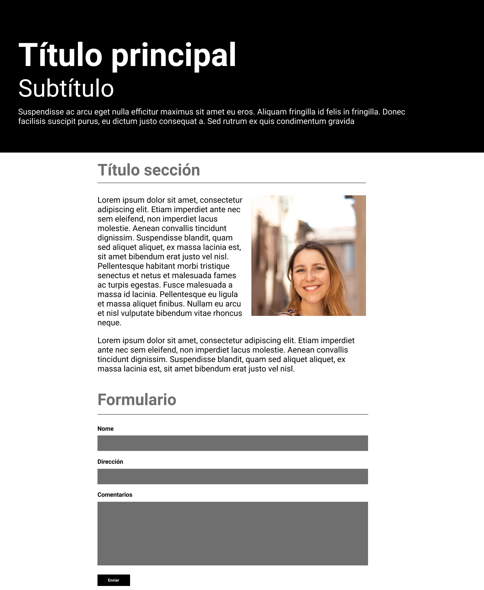

# SEGUNDA MAQUETA

Edita los ficheros "index.html" y "style.css" de tu derecha para realizar la siguiente maqueta:

La imagen necesaria está incluida en la carpeta img que verás si despliegas los archivos usando el primer icono a la izquierda del editor (ver abajo vídeo explicativo si tienes dudas).

El resultado final debe funcionar y visualizarse correctamente al pulsar el botón verde "Run" en la parte superior del editor.

El HTML resultante debe ser validado por el validador de HTML de la W3 y el CSS en el Validador de CSS de la W3 y no deben dar ningún error.
