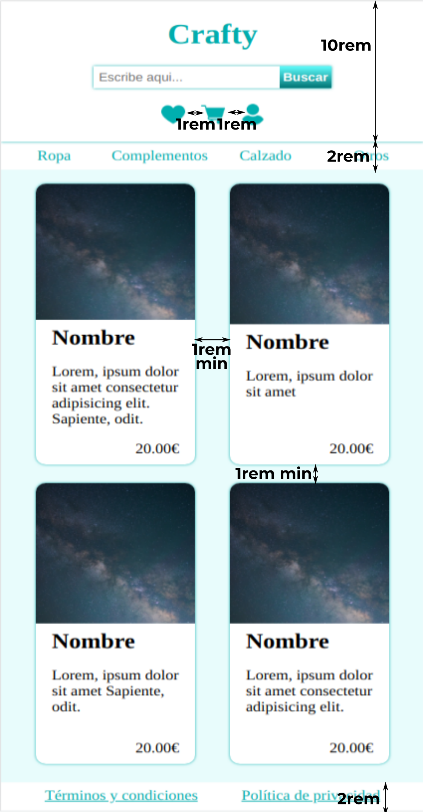

# MAQUETA COMPLEJA

Sin modificar el código HTML edita el fichero style.css para crear un layout responsive como el de las imágenes siguientes.

(Las imágenes de los productos que verás serán diferentes a las de las capturas, no te preocupes por eso.)

- Versión para pantallas pequeñas:
  

- Versión para pantallas grandes:
  

Usa Grid para maquetar el layout general de la página (body) y Flex para los elementos (header, menús, main, articles...). Usa las media queries necesarias para que el diseño se adapte a los diferentes tipos de pantalla.

Requerimientos extra:

    - En un proyecto real la cantidad de elementos (los "article" hijos de "main") dependerá de los resultados de búsqueda, y debe verse correctamente haya uno o varios. Puedes probar esto comentando varios "article" (usando la síntaxis de comentarios de HTML).

    - Aunque no haya elementos suficientes para que la página ocupe toda la altura del viewport del navegador el "footer" no debe subir por falta de contenido.
